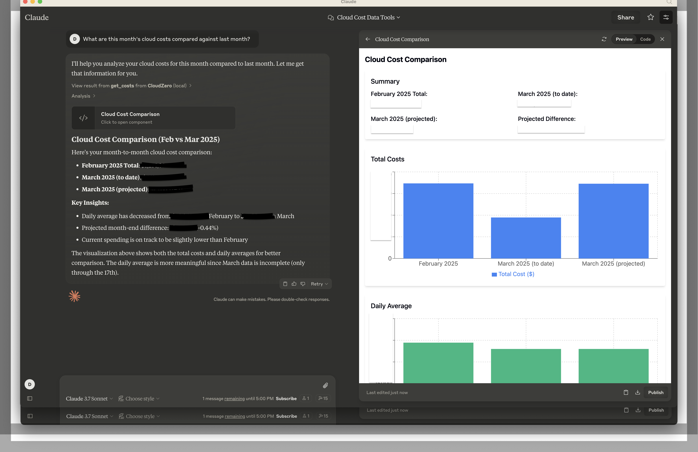
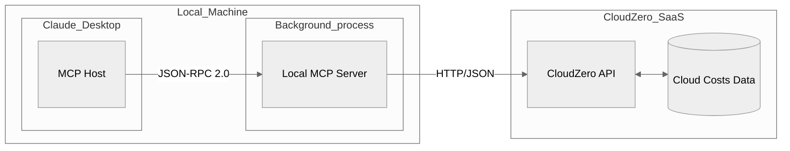
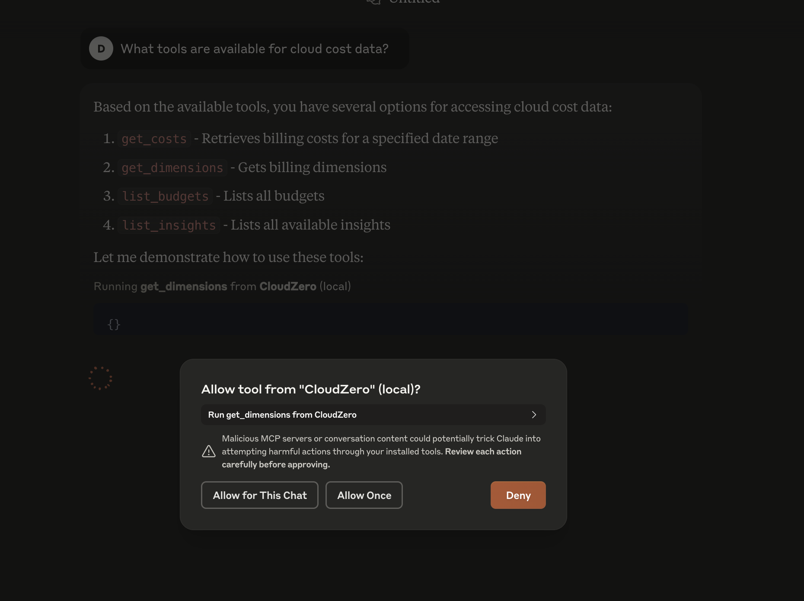
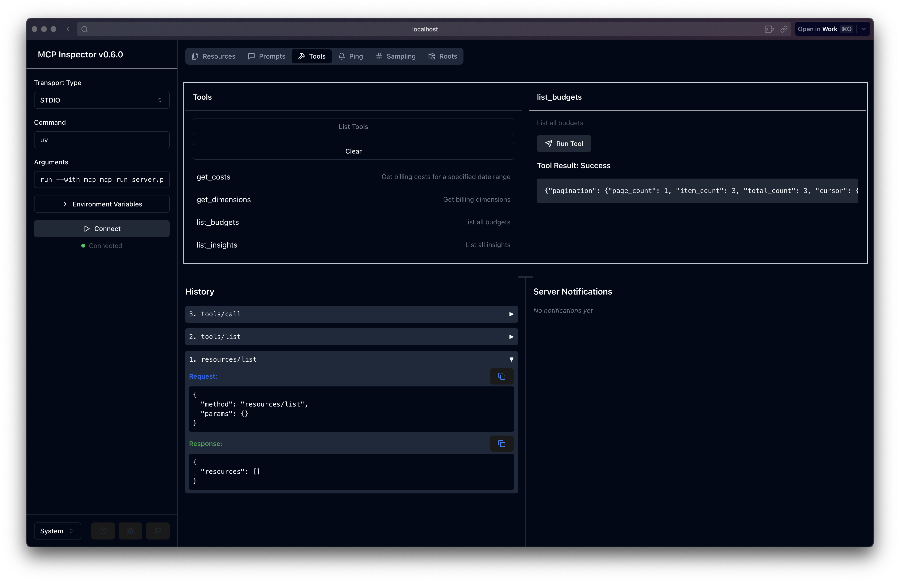

# Cloudzero Model Context Protocol (MCP) server

Talk to your cloud cost data in Cloudzero from a Large Language Model (LLM).

Ask questions about your cost data such as plotting a month over month difference:



## How it works

Uses [CloudZero v2 API](https://docs.cloudzero.com/reference/introduction) and the [Model Context Protocol](https://modelcontextprotocol.io/introduction) MCP.



## Setup

Install [Claude Desktop](https://claude.ai/download):

Install [uv](https://docs.astral.sh/uv/)

Setup the project dependencies:

```bash
uv init
uv sync
```

Generate your [CloudZero API key](https://app.cloudzero.com/organization/api-keys).

Edit `.env` with:

```text
CLOUDZERO_API_KEY=YOUR_SECRET_KEY
```

## Install

To install the MCP server into Claude Desktop:

```bash
uv run mcp install server.py
```

Edit your `claude_desktop_config.json` to set the proper path to the `uv` command and update your `USERNAME` as below.

This config file can be located in Claude Desktop under `Settings > Developer > Edit Config`.

```json
    "CloudZero": {
      "command": "/Users/USERNAME/.local/bin/uv",
      "args": [
        "run",
        "--with",
        "mcp[cli]",
        "mcp",
        "run",
        "/Users/USERNAME/workspace/open_source/cloudzero-mcp/server.py"
      ]
    }
```

Restart Claude Desktop.  When the Desktop starts, it will launch the server process in the background.
You may see errors, and can drill into the logs to see what the problem is.

If no errors, try asking "what tools are available for cloud billing" to see it listed.



See [Claude Desktop MCP documentation](https://modelcontextprotocol.io/quickstart/user) for more info.

## Debug

For debugging, you can run the MCP development server with an interactive GUI to inspect:

```bash
uv run mcp dev server.py
```

This is useful for troubleshooting bugs in your code without having to continuously restart Claude Desktop.


